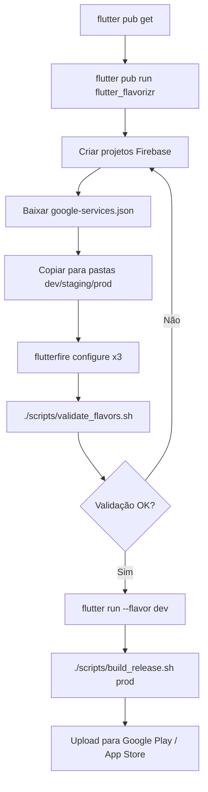

# 📱 Exemplo Visual - Flavors WeGig

Este arquivo mostra como ficará a estrutura após executar `flutter pub run flutter_flavorizr`.

---

## 📂 Estrutura de Pastas (Após Flavorizr)

```
to_sem_banda/
├── lib/
│   ├── config/                        ✅ CRIADO
│   │   ├── dev_config.dart           ✅ Configurações DEV
│   │   ├── staging_config.dart       ✅ Configurações STAGING
│   │   ├── prod_config.dart          ✅ Configurações PROD
│   │   └── app_config.dart           ✅ Acesso centralizado
│   │
│   ├── main.dart                      ℹ️  Main original
│   ├── main_dev.dart                  🔜 Gerado por flavorizr
│   ├── main_staging.dart              🔜 Gerado por flavorizr
│   ├── main_prod.dart                 🔜 Gerado por flavorizr
│   │
│   ├── firebase_options_dev.dart      ⏳ Você cria com flutterfire
│   ├── firebase_options_staging.dart  ⏳ Você cria com flutterfire
│   └── firebase_options_prod.dart     ⏳ Você cria com flutterfire
│
├── android/
│   └── app/
│       ├── build.gradle               🔜 Atualizado por flavorizr
│       └── src/
│           ├── main/                  ℹ️  Existente
│           ├── dev/                   🔜 Gerado por flavorizr
│           │   ├── AndroidManifest.xml
│           │   ├── google-services.json  ⏳ Você copia do Firebase
│           │   └── res/
│           │       └── values/
│           │           └── strings.xml (WeGig DEV)
│           ├── staging/               🔜 Gerado por flavorizr
│           │   ├── AndroidManifest.xml
│           │   ├── google-services.json  ⏳ Você copia do Firebase
│           │   └── res/
│           │       └── values/
│           │           └── strings.xml (WeGig STAGING)
│           └── prod/                  🔜 Gerado por flavorizr
│               ├── AndroidManifest.xml
│               ├── google-services.json  ⏳ Você copia do Firebase
│               └── res/
│                   └── values/
│                       └── strings.xml (WeGig)
│
├── ios/
│   ├── Flutter/
│   │   ├── Debug.xcconfig             ℹ️  Existente
│   │   ├── Release.xcconfig           ℹ️  Existente
│   │   ├── Dev.xcconfig               🔜 Gerado por flavorizr
│   │   ├── Staging.xcconfig           🔜 Gerado por flavorizr
│   │   └── Prod.xcconfig              🔜 Gerado por flavorizr
│   │
│   ├── Firebase/                      ⏳ Você cria manualmente
│   │   ├── dev/
│   │   │   └── GoogleService-Info.plist  ⏳ Você copia do Firebase
│   │   ├── staging/
│   │   │   └── GoogleService-Info.plist  ⏳ Você copia do Firebase
│   │   └── prod/
│   │       └── GoogleService-Info.plist  ⏳ Você copia do Firebase
│   │
│   └── Runner.xcodeproj/
│       └── project.pbxproj            🔜 Atualizado por flavorizr (schemes)
│
├── scripts/
│   ├── build_release.sh               ✅ CRIADO/ATUALIZADO
│   └── validate_flavors.sh            ✅ CRIADO
│
├── flavorizr.yaml                     ✅ CRIADO
├── pubspec.yaml                       ✅ ATUALIZADO
├── .gitignore                         ✅ ATUALIZADO
│
├── FLAVOR_SETUP_GUIDE.md              ✅ CRIADO
├── FLAVOR_IMPLEMENTATION_COMPLETE.md  ✅ CRIADO
├── FLAVOR_QUICK_START.md              ✅ CRIADO
└── README.md                          ✅ ATUALIZADO
```

**Legenda:**

- ✅ **CRIADO** - Arquivo criado agora
- 🔜 **GERADO** - Será gerado automaticamente por `flutter pub run flutter_flavorizr`
- ⏳ **VOCÊ CRIA** - Precisa criar/copiar manualmente (Firebase configs)
- ℹ️ **EXISTENTE** - Já existe no projeto

---

## 📝 Conteúdo dos Arquivos Gerados

### `lib/main_dev.dart` (Gerado por flavorizr)

```dart
import 'package:flutter/material.dart';
import 'main.dart' as runner;

void main() {
  runner.main();
}
```

### `android/app/src/dev/AndroidManifest.xml` (Gerado por flavorizr)

```xml
<manifest xmlns:android="http://schemas.android.com/apk/res/android"
    package="com.tosembanda.wegig.dev">
    <application
        android:label="WeGig DEV"
        android:icon="@mipmap/ic_launcher">
    </application>
</manifest>
```

### `ios/Flutter/Dev.xcconfig` (Gerado por flavorizr)

```xcconfig
#include "Pods/Target Support Files/Pods-Runner/Pods-Runner.dev.xcconfig"
#include "Generated.xcconfig"

PRODUCT_BUNDLE_IDENTIFIER = com.tosembanda.wegig.dev
DISPLAY_NAME = WeGig DEV
```

---

## 🎨 Ícones Gerados (Badges)

Após `flutter pub run flutter_flavorizr`, você verá ícones com badges:

```
DEV Flavor:
┌─────────────────┐
│                 │
│   [Ícone Base]  │
│                 │
│   🟦 DEV        │ ← Badge azul
└─────────────────┘

STAGING Flavor:
┌─────────────────┐
│                 │
│   [Ícone Base]  │
│                 │
│   🟪 STAGING    │ ← Badge roxo
└─────────────────┘

PROD Flavor:
┌─────────────────┐
│                 │
│   [Ícone Base]  │
│                 │
│   (sem badge)   │ ← Ícone limpo
└─────────────────┘
```

---

## 🔥 Firebase Configs (Você Precisa Criar)

### Estrutura de Pastas Firebase

```bash
# ANDROID
android/app/src/dev/google-services.json
android/app/src/staging/google-services.json
android/app/src/prod/google-services.json

# IOS
ios/Firebase/dev/GoogleService-Info.plist
ios/Firebase/staging/GoogleService-Info.plist
ios/Firebase/prod/GoogleService-Info.plist

# DART (gerados com flutterfire configure)
lib/firebase_options_dev.dart
lib/firebase_options_staging.dart
lib/firebase_options_prod.dart
```

### Comandos para Criar

```bash
# 1. Criar estrutura de pastas
mkdir -p android/app/src/{dev,staging,prod}
mkdir -p ios/Firebase/{dev,staging,prod}

# 2. Baixar arquivos do Firebase Console
# (você faz manualmente no console.firebase.google.com)

# 3. Gerar firebase_options por flavor
flutterfire configure --project=to-sem-banda-dev \
  --out=lib/firebase_options_dev.dart \
  --ios-bundle-id=com.tosembanda.wegig.dev \
  --android-app-id=com.tosembanda.wegig.dev

flutterfire configure --project=to-sem-banda-staging \
  --out=lib/firebase_options_staging.dart \
  --ios-bundle-id=com.tosembanda.wegig.staging \
  --android-app-id=com.tosembanda.wegig.staging

flutterfire configure --project=to-sem-banda-83e19 \
  --out=lib/firebase_options_prod.dart \
  --ios-bundle-id=com.tosembanda.wegig \
  --android-app-id=com.tosembanda.wegig
```

---

## 📱 Resultado Final (3 Apps Instalados)

Após instalar os 3 flavors no mesmo dispositivo:

```
╔════════════════════════════════════════╗
║  Tela do Dispositivo                   ║
╠════════════════════════════════════════╣
║                                        ║
║  🟦 WeGig DEV                          ║
║     com.tosembanda.wegig.dev           ║
║                                        ║
║  🟪 WeGig STAGING                      ║
║     com.tosembanda.wegig.staging       ║
║                                        ║
║  🔴 WeGig                              ║
║     com.tosembanda.wegig               ║
║                                        ║
╚════════════════════════════════════════╝
```

**Cada app:**

- ✅ Roda independentemente
- ✅ Tem seus próprios dados (Firebase isolado)
- ✅ Tem Bundle ID único (podem coexistir)
- ✅ Tem ícone diferente (visual único)
- ✅ Tem configurações diferentes (logs, APIs)

---

## 🎯 Fluxo Completo de Build



---

## ✅ Checklist Visual

### ✅ Já Feito

- [x] Arquivos de config Dart criados (4 arquivos)
- [x] Script de build atualizado
- [x] Script de validação criado
- [x] Documentação completa (4 guias)
- [x] flavorizr.yaml configurado
- [x] pubspec.yaml atualizado
- [x] .gitignore atualizado

### 🔜 Será Gerado Automaticamente (Flavorizr)

- [ ] lib/main\_{dev,staging,prod}.dart
- [ ] android/app/src/{dev,staging,prod}/
- [ ] ios/Flutter/{Dev,Staging,Prod}.xcconfig
- [ ] Ícones com badges

### ⏳ Você Precisa Criar Manualmente

- [ ] 2 novos projetos Firebase (dev, staging)
- [ ] google-services.json (3 arquivos)
- [ ] GoogleService-Info.plist (3 arquivos)
- [ ] firebase*options*{dev,staging,prod}.dart (via flutterfire)

---

**🎉 Depois disso, basta rodar:**

```bash
./scripts/build_release.sh prod
```

**E ter um APK/AAB de produção com:**

- ✅ Código ofuscado
- ✅ Símbolos separados
- ✅ ProGuard habilitado
- ✅ Firebase prod isolado
- ✅ Logs desabilitados
- ✅ Pronto para Google Play Store!
